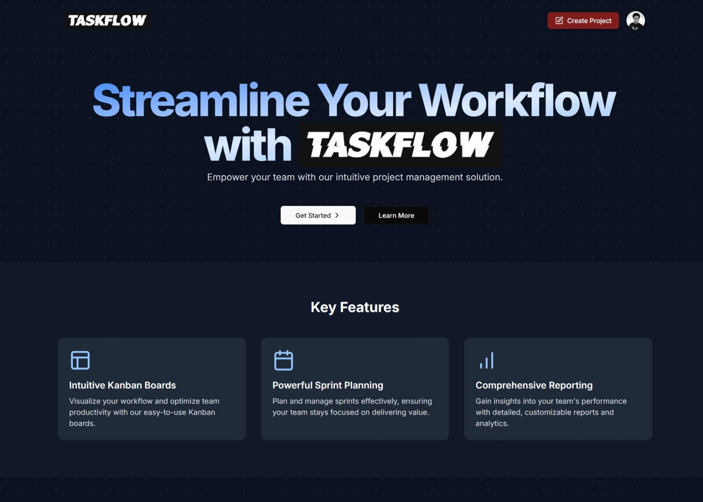

# TaskFlow
# Full Stack Project Management App with Next JS, React, Tailwind CSS, Prisma, Neon, Clerk, Shadcn UI





## Features

- **Authentication & Authorization:** Clerk sign-up/sign-in with Google, email, and password. Multi-org support.
- **Organizations:** Create and switch active organizations.
- **Projects:** List, create, and delete projects scoped to an organization.
- **Sprints:** Create sprints under a project, manage sprint status (Planned, Active, Completed).
- **Issues:** Create, update, delete issues in sprints. Drag-and-drop kanban board.
- **Board Filters:** Search, assignee and priority filters for issues.
- **Responsive UI:** Tailwind CSS and custom components.

## Tech Stack

- **Next.js (App Router)**
- **Clerk** for authentication and organization membership
- **Prisma** with a **NeonDB** database
- **React** (client components) and server actions
- **Tailwind CSS** and **Shadcn UI** for styling
- **react-day-picker**, **react-hook-form**, **Zod** for forms and validation
- **@hello-pangea/dnd** for drag-and-drop


### Make sure to create a `.env` file with following variables -

```
DATABASE_URL=

NEXT_PUBLIC_CLERK_PUBLISHABLE_KEY=
CLERK_SECRET_KEY=

NEXT_PUBLIC_CLERK_SIGN_IN_URL=/sign-in
NEXT_PUBLIC_CLERK_SIGN_UP_URL=/sign-up
NEXT_PUBLIC_CLERK_AFTER_SIGN_IN_URL=/onboarding
NEXT_PUBLIC_CLERK_AFTER_SIGN_UP_URL=/onboarding
```


